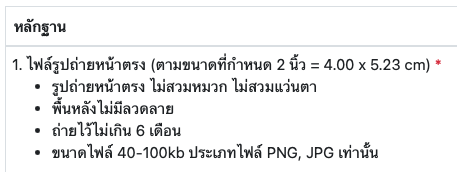
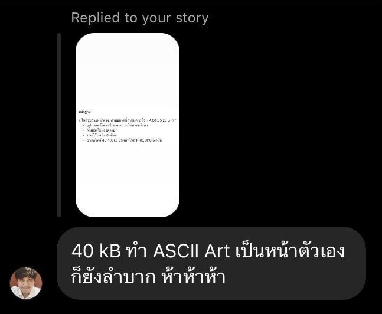

# img2asciiart-40kb

Convert images to ASCII art 🎨, all thanks to my government's generous 40KB size limit. Who needs high-res when you've got bureaucracy.

---

They said it should be under 40KB, so guess what?  

**Challenge accepted!**

Presenting the wonder of the digital age: a repo that converts images to ASCII art. The resulting work of art AND the code itself are always under 40KB. Who knew such brilliance could fit in so little space? 😉

## The Story

The sun had barely risen, painting the sky with hues of pink and gold, when I found myself on a government website, trying to register for a service. The task seemed simple enough: upload a 2-inch photo for my licensing card. Just when I thought I was almost done, a message pop in to my eyes,  

> "File size limit: 40KB."

I blinked. 40KB? For a photo? Really?

Incredulous, I snapped a screenshot and shared it on my IG's story, captioned with a sarcastic. The likes and laughs started pouring in, but one particular comment caught my attention.  

[@singhana](https://github.com/singhanat) : "With 40KB, even making an ASCII art of your own face would be a challenge."

> "...with that size, they probably want an ASCII art of your face."

I chuckled, but then it hit me. What would an ASCII representation of my face look like, especially under such a strict size constraint?

The rest of the night blurred into a frenzy of coding and experimentation. I pulled up various tools, tweaked algorithms, and compressed outputs, trying to fit the picture within the mystical 40KB limit. After countless trials, I finally managed to convert my face into a striking ASCII image, all under the set size limit.

With a mix of pride and amusement, I updated my Instagram story, showcasing my ASCII face.

**Government requirements met. Behold, my 40KB face.**

Little did I know, that fleeting moment of mischief would lead to the birth of a repository. A repository dedicated to proving that sometimes, limitations breed the most creative solutions.

And that's how I got here.

## How to run it

This is just a simple Python script. You can run it on any environment that supports Python 3.6+ and pillow 8.0.1+.

    pip install pillow

then run the script

    python main.py

The script will prompt you to enter the path to the image you want to convert. Or just simply type file name if the image is in the same folder as the script. the output will be saved in the same folder as the image with the same name but ending with `_ascii.txt`. Noted that the output file will be overwritten if it already exists.

Enjoy! :P